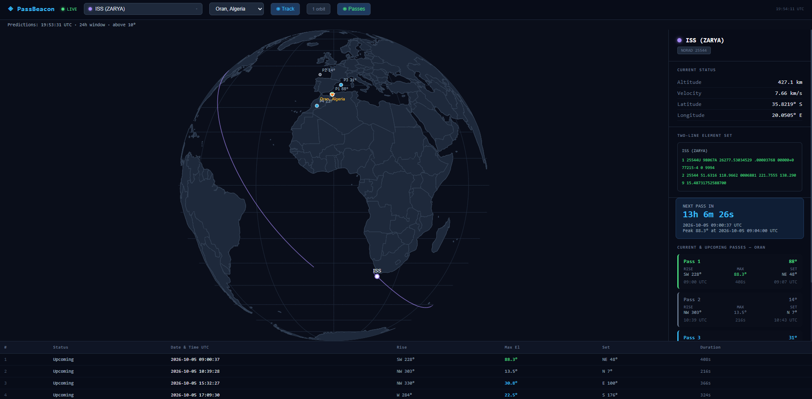
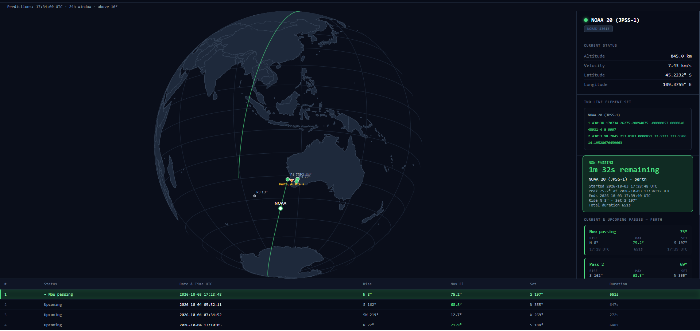

# PassBeacon

Version **1.0.0**.

PassBeacon is a satellite tracking and ground-station pass prediction application. It displays satellite positions and orbital ground tracks on an interactive globe, helping users explore where satellites are, when they will pass within view of a ground station, and how long each pass window lasts.

The application combines a React interface with a Python backend powered by Skyfield. Orbital elements from CelesTrak are used to calculate positions and predict passes, while separate command-line tools support station reports and comparisons.

## Screenshots

### Satellite tracking


### Active pass


## Features

- **Interactive globe:** rotate and zoom the Earth, view satellite ground tracks, and locate the selected ground station with a labeled marker.
- **Satellite and station selection:** explore the configured satellite catalog and switch between ground stations.
- **Live position updates:** view calculated latitude, longitude, altitude, and velocity as time advances.
- **Pass predictions:** inspect rise time, peak elevation, set time, duration, and rise/set azimuths.
- **Configurable predictions:** view one orbital ground track or the full prediction period, with a default of 24 hours and a backend-configurable range of 1–168 hours.
- **Automatic refresh:** update tracks and predictions in the background, with warnings for stale data and calculation failures.
- **Cached orbital data:** reuse downloaded TLEs and support cached-data operation when offline.
- **Command-line tracker:** generate terminal reports, compare ground stations, and watch changing conditions.
- **HTTP API and WebSockets:** access satellite information, station definitions, pass predictions, and position updates programmatically.

Positions are propagated from Two-Line Element sets (TLEs) using Skyfield/SGP4. They are calculated estimates, not telemetry received directly from satellites. Pass prediction uses Skyfield's event search.

## Contents

- [Technology](#technology)
- [Requirements](#requirements)
- [Installation on Windows](#installation-on-windows)
- [Installation on Linux and macOS](#installation-on-linux-and-macos)
- [Running the built application](#running-the-built-application)
- [Using the globe and pass predictions](#using-the-globe-and-pass-predictions)
- [Data refresh and freshness](#data-refresh-and-freshness)
- [Configuration](#configuration)
- [Adding satellites and ground stations](#adding-satellites-and-ground-stations)
- [Command-line tracker](#command-line-tracker)
- [Offline operation](#offline-operation)
- [API](#api)
- [Project structure](#project-structure)
- [Development and tests](#development-and-tests)
- [Troubleshooting](#troubleshooting)
- [Limitations and hosting](#limitations-and-hosting)

## Technology

| Component | Technologies |
| --- | --- |
| Browser interface | React, Vite |
| Globe and geographic plots | Plotly through `react-plotly.js` |
| Backend and API | Python, FastAPI, Uvicorn |
| Orbit propagation and pass events | Skyfield / SGP4 |
| Orbital elements | CelesTrak TLE data |
| Live updates | WebSockets |
| Terminal presentation | Rich |

## Requirements

- Python 3.12 or 3.13.
- Node.js 24 and npm for the browser interface; CLI-only use does not require Node.js.
- Internet access for dependency installation and initial orbital-data downloads.
- A modern desktop browser.

No database or API key is required. Use a dedicated Python virtual environment for the application. The default Python installation includes the backend and command-line tracker.

Clone the repository or download and extract its source archive. Run the setup commands from the repository root: the directory containing `pyproject.toml`, `backend/`, and `frontend/`. Check your selected Python version with `python --version` or `python3 --version` before creating the environment.

## Installation on Windows

Open two terminals: one for the backend and one for the frontend.

Terminal 1, from the root:

```powershell
python -m venv .venv
.\.venv\Scripts\python.exe -m pip install -r requirements-tools.txt -c constraints-tested.txt
.\.venv\Scripts\python.exe -m sattrack.server
```

Wait for Uvicorn to report startup complete. The initial orbital-data load can take time, particularly if requests time out. Errors are logged with the affected satellite ID.

Terminal 2, from the root:

```powershell
cd frontend
npm ci
npm run dev
```

Open http://localhost:5173. Keep both terminals running. Stop them with Ctrl+C.

Using the virtual environment's executable directly avoids activation-policy problems. If you already activated it, `python` is sufficient. `npm.cmd` avoids PowerShell script-policy problems; plain `npm` also works in suitable shells.

## Installation on Linux and macOS

From the root:

```bash
python3 -m venv .venv
.venv/bin/python -m pip install -r requirements-tools.txt -c constraints-tested.txt
.venv/bin/python -m sattrack.server
```

In a second terminal:

```bash
cd frontend
npm ci
npm run dev
```

## Running the built application

Build the frontend first:

```bash
cd frontend
npm ci
npm run build
cd ..
```

Then run the same Python server command from the quick start and open http://localhost:8000. FastAPI serves `frontend/dist` when that folder exists at server startup. Restart after creating the first build. Rebuild after frontend source changes.

The build and development UI both use same-origin `/api` and `/ws` paths. Vite proxies those paths during development. No permissive CORS configuration is needed for these supported setups.

For Python auto-reload during development, use:

```powershell
.\.venv\Scripts\python.exe -m uvicorn sattrack.app:create_app --factory --reload --reload-dir backend --port 8000
```

This Uvicorn command takes its host/port from command flags; `python -m sattrack.server` reads the host/port environment settings below.

## Using the globe and pass predictions

- **Satellite search:** choose a successfully loaded satellite.
- **Ground station:** choose a station from the backend catalog. Additions require only a catalog edit and backend restart.
- **Track:** show/hide the ground track.
- **1 orbit / full window:** choose one orbital period or the configured prediction window.
- **Passes:** show/hide pass markers on the globe; the table remains visible.
- Drag to rotate, wheel to zoom. Loading indicators retain the previous view until the new selection is ready.

An orange marker identifies the selected ground station and remains visible when tracks or pass markers are hidden. Stations on the far side of Earth become visible when the globe is rotated toward them. The circular viewing window remains round when zoomed in; zoom out to see the whole globe.

The details panel receives position updates approximately every second. The globe refreshes its satellite marker every five seconds and waits for dragging or zooming to stop before applying updates. A loading notice appears while a new selection is being prepared.

| Field | Meaning |
| --- | --- |
| AOS / rise | Satellite crosses above the configured elevation threshold. |
| TCA / peak | Maximum-elevation event used as the pass peak. |
| LOS / set | Satellite crosses below the elevation threshold. |
| Duration | Seconds between AOS and LOS. |
| Azimuth | Direction measured clockwise from north, in degrees. |
| Elevation | Angle above the local horizon, in degrees. |

The pass card changes from **Next pass in** to **Now passing** between AOS and LOS, with a countdown to the end, start/peak/end times, maximum elevation, duration, and rise/set directions. It updates every second and returns to the next pass after LOS. This uses the selected station and the configured elevation threshold, not the satellite’s proximity on the map. Refreshing or opening the app during an ordinary pass preserves that pass. Finished passes disappear from the sidebar list.

The default elevation threshold is **10°**. Pass and update times are shown in **UTC**. Pass quality is labeled EXCELLENT above 45°, GOOD above 20°, and LOW otherwise. These labels describe the maximum elevation of a pass; they do not predict naked-eye visibility.

## Data refresh and freshness

Tracks and passes refresh automatically. By default, the backend waits five minutes after each refresh finishes before starting the next one. The application remains available while the next prediction set is calculated.

TLE requests reuse downloaded elements for 24 hours by default. Thus a five-minute prediction refresh usually recalculates from the same TLE. Once the download cache is old enough, the next refresh attempts a download.

The browser loads the refreshed predictions automatically. Recent selection results are briefly cached to reduce repeated requests when switching between satellites and stations.

The status strip shows the prediction horizon, elevation threshold, and last snapshot timestamp. It reports refresh errors and selected-satellite warnings. `/api/status` provides detailed errors and warnings for every loaded satellite.

Two dates matter: **download time** and **TLE epoch**. A newly downloaded file can still describe an old orbit. The app warns when the epoch differs from now by more than 72 hours by default; this is a configurable warning threshold, not an accuracy guarantee.

If refresh fails for a previously loaded satellite, previous predictions are retained with a warning. If a station's pass calculation fails, its endpoint returns HTTP 503; the browser displays an error instead of claiming there are no passes.

## Configuration

Settings are read when the backend starts. Restart after changes. `.env` files are not loaded by the Python backend; set variables in the shell or host configuration.

| Variable | Default | Meaning |
| --- | --- | --- |
| `SATTRACK_HOST` | `127.0.0.1` | Server listen address for `sattrack.server` |
| `SATTRACK_PORT` | `8000` | Server port for `sattrack.server` |
| `SATTRACK_CACHE_DIR` | `~/.cache/sattrack` | Writable directory for per-satellite JSON caches |
| `SATTRACK_OFFLINE` | `0` | Set `1`, `true`, or `yes` to use only cached TLEs |
| `SATTRACK_HOURS` | `24` | Web prediction window, 1–168 hours |
| `SATTRACK_MIN_ELEVATION` | `10` | Pass threshold, 0 inclusive to 90 exclusive |
| `SATTRACK_REFRESH_SECONDS` | `300` | Wait between refreshes; minimum 30 seconds |
| `SATTRACK_TLE_MAX_AGE_HOURS` | `24` | Download-cache age before retrying CelesTrak |
| `SATTRACK_EPOCH_WARNING_HOURS` | `72` | Age threshold for an orbital-epoch warning |
| `SATTRACK_FRONTEND_DIR` | repository `frontend/dist` | Built frontend location |
| `SATTRACK_API_TARGET` | `http://127.0.0.1:8000` | Vite-only proxy target; set in frontend shell or `frontend/.env.local` |

Windows example, from the repository root before starting the backend:

```powershell
$env:SATTRACK_CACHE_DIR = "$PWD\.cache"
$env:SATTRACK_HOURS = "48"
$env:SATTRACK_PORT = "8001"
.\.venv\Scripts\python.exe -m sattrack.server
```

In the frontend terminal, match the changed port:

```powershell
$env:SATTRACK_API_TARGET = "http://127.0.0.1:8001"
npm.cmd run dev
```

Linux/macOS use `export NAME=value`. Vite stays on port 5173 and fails if the port is busy instead of choosing another silently.

## Adding satellites and ground stations

Edit `backend/sattrack/catalog.py`:

- `STATIONS`: station key, display name, latitude, longitude, altitude in metres.
- `SATELLITES`: NORAD ID, display name, and display color.

For example, add a ground station inside `STATIONS`:

```python
"new_york": {
    "name": "New York, USA",
    "lat": 40.7128,
    "lon": -74.0060,
    "alt": 15,
},
```

Latitude is positive north and negative south. Longitude is positive east and negative west. Altitude is in metres.

Satellite entries in `SATELLITES` use a string NORAD ID as their key:

```python
"25544": {"name": "ISS (ZARYA)", "color": "#a78bfa"},
```

Edit an existing key or add a new one; avoid duplicate dictionary keys. Restart the backend after changing the catalog. The station dropdown reads the catalog through the API, so it requires no separate frontend edit. A satellite appears in the web interface once its orbital data loads successfully. The CLI can also request a NORAD ID outside the web catalog if CelesTrak provides its TLE.


## Command-line tracker

The standard Python installation above includes these tools. Run them from the repository root; the backend server and browser do not need to be running.

```powershell
.\.venv\Scripts\python.exe -m sattrack.cli --help
.\.venv\Scripts\python.exe -m sattrack.cli --sat 20580 --gs london --hours 48
.\.venv\Scripts\python.exe -m sattrack.cli --compare oran algiers paris
.\.venv\Scripts\python.exe -m sattrack.cli --gs oran --watch
```

Linux/macOS replace the executable with `.venv/bin/python`. With the environment activated, installed shortcuts `sattrack` and `sattrack-server` are also available.

| Tracker option | Default | Purpose |
| --- | --- | --- |
| `--sat` | `25544` | NORAD catalog ID. |
| `--gs` | `oran` | Ground-station key from the catalog. |
| `--hours` | `24` | Positive prediction window in hours. |
| `--watch` | Off | Refresh the terminal report every ten seconds. |
| `--compare` | Not set | Compare multiple station keys, separated by spaces. |

The report heading reflects `--hours`, and elevation status uses `SATTRACK_MIN_ELEVATION` (10° by default). **Surface distance** is the approximate distance along Earth to the satellite’s ground position; **slant range** is the direct distance from the station to the satellite. Station comparisons show **Total Pass Time**, the sum of complete pass durations above the threshold. Reports warn when the TLE epoch differs from the calculation time by more than `SATTRACK_EPOCH_WARNING_HOURS`.

Compare mode takes precedence over watch mode. Quote station keys that contain spaces, for example `--gs "new york"`. The CLI's `--hours` controls its own horizon; `SATTRACK_HOURS` controls the web service. Reports are printed to the terminal. Stop watch mode with Ctrl+C.


## Offline operation

After at least one successful online load, set `SATTRACK_OFFLINE=1` in the backend/CLI shell. The cache uses one `<NORAD-ID>.json` per satellite under `SATTRACK_CACHE_DIR`.

Windows:

```powershell
$env:SATTRACK_OFFLINE = "1"
.\.venv\Scripts\python.exe -m sattrack.server
```

Linux/macOS:

```bash
export SATTRACK_OFFLINE=1
.venv/bin/python -m sattrack.server
```

Set the variable to `0` to resume downloads, then restart the backend. Offline mode requires an existing valid cache for each satellite; it cannot create orbital data on the first run.

Plotly can require network access for geographic map assets. Cached TLEs alone do not guarantee a completely offline globe.

## API

| Route | Purpose |
| --- | --- |
| `GET /api/health` | Service/version and loaded-satellite count |
| `GET /api/status` | Snapshot generation, age-related warnings, settings, errors |
| `GET /api/stations` | Ground-station catalog |
| `GET /api/satellites` | Loaded satellite list |
| `GET /api/satellites/{id}` | Position, track, TLE, epoch, fetch time, source, warnings |
| `GET /api/passes/{id}?gs=oran` | Station-specific pass predictions |
| `WS /ws/satellites` | Current positions and snapshot status |
| `/docs` | Interactive API documentation |

A responding health endpoint does not guarantee complete data. Check loaded count and status. Unknown IDs/stations return 404. Pass calculation failures return 503. No authentication is implemented.

## Project structure

```text
backend/sattrack/
  app.py              FastAPI routes, WebSockets, and application lifecycle
  server.py           Backend launcher
  settings.py         Environment configuration
  catalog.py          Satellite and ground-station definitions
  tle.py              Orbital-data downloads and disk cache
  orbits.py           Geometry, pass prediction, and shared calculations
  tracking.py         Runtime state and scheduled refreshes
  cli.py              Command-line tracker
  display.py          Terminal presentation
frontend/
  src/                React components, hooks, and API access
  tests/              Frontend regression checks
pyproject.toml        Python package and dependency definitions
requirements*.txt     Web-only or complete Python installation
constraints-tested.txt  Pinned Python dependency versions
```

## Development and tests

`pyproject.toml` defines the installable Python package and its dependencies. `requirements-tools.txt` installs the backend and CLI tools together. `requirements.txt` is an optional web-only installation without the Rich terminal-presentation dependency. `constraints-tested.txt` pins Python dependency versions for reproducible setup. Use it with `-c` as shown above; it is a version snapshot rather than a hash-verified cross-platform lockfile.

`frontend/package.json` declares JavaScript dependencies and commands; `package-lock.json` records their resolved versions. Keep both. `npm ci` uses the lockfile. Do not commit `node_modules` or your virtual environment.

```powershell
cd frontend
npm.cmd test
npm.cmd run lint
npm.cmd run build
```

Frontend tests cover request caching, globe update scheduling, and ground-station updates. Run the commands above locally before publishing frontend changes. No automated CI pipeline is included.

After updating an existing installation, rerun the Python installation command to refresh installed package metadata and command shortcuts.

## Troubleshooting

- **Module `sattrack` missing:** install from the repository root with the same Python executable used to launch. Do not run files inside `backend/sattrack` directly.
- **Blank/offline app:** let startup finish, verify backend port and Vite proxy target, and check `/api/status`.
- **No satellites:** check CelesTrak access, cache availability, and startup logs. Automatic refresh retries later.
- **No passes:** some orbits produce no complete rise/peak/set event in the configured window. Continuously visible satellites and passes ending beyond the prediction window may not appear. Active passes are recovered using a bounded lookback of at least three hours (up to 48 hours for long-period orbits).
- **Old elements:** check the warning and TLE epoch, not only the download timestamp.
- **Windows/Conda MKL crash:** if an error identifies an MKL threading-library problem, try `$env:MKL_THREADING_LAYER="SEQUENTIAL"` before launching Python. This is an environment-specific workaround, not a normal setup requirement.
- **Backend `/` returns 404:** use port 5173 in development, or build the frontend and restart for single-server mode.

## Limitations and hosting

- **Prediction latency:** the horizon advances on refresh, not continuously every second. Large catalogs or long horizons cost more startup/refresh time.
- **Desktop layout:** small-screen presentation still needs work.

For public hosting, use a Python-capable host and an HTTPS reverse proxy that supports WebSockets. Use one backend worker: each process otherwise has a separate tracker and refresh loop. GitHub Pages alone cannot run the Python backend. Authentication, TLS, deployment, and persistent user settings are not included.

Copyright © 2026 mmansourim. All rights reserved.